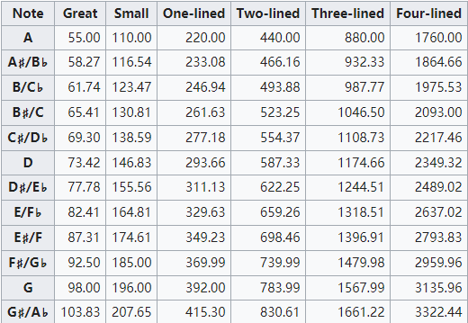
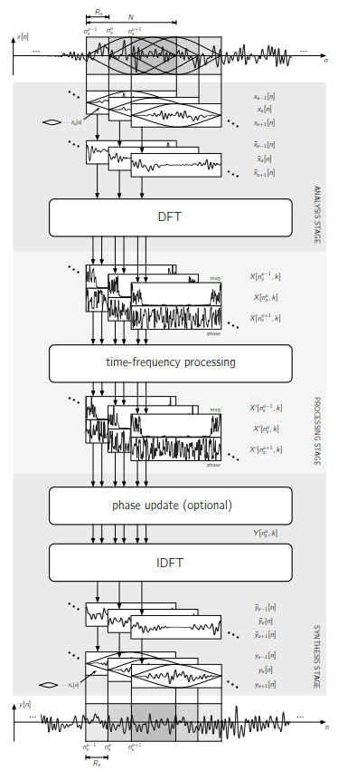
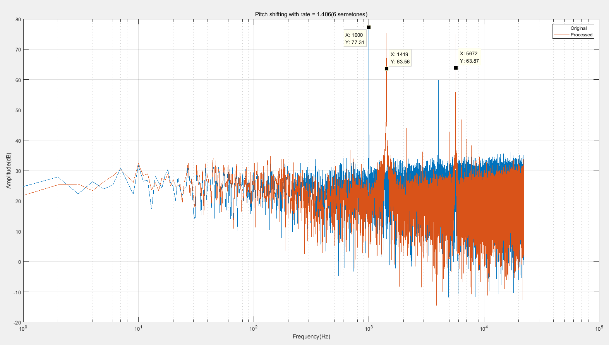
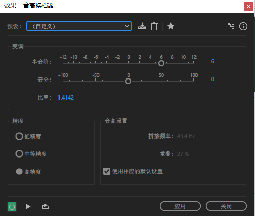

# Pitch shifting User manual 

v1.0	初步完善pitch shifting的原理介绍及实现方式

## Introduction

**Pitch shifting** effect: 	变调，移相效果器，该效果器可以实现对原始音频音调的调整，进行升调或者降调，升降的程度通过半音阶^[1]^ (semetone)来衡量。可用于电子变声器、吉他变调器以及卡拉Ok应用中^[2]^。

### 实现方式

​	实现pitch shifting effect的方式有以下几种：

- **Time scaling and resampling**

  ​	最简单的方式，通过调整采样率改变最终播放的时长(duration)，从而改变音调，实现变调功能。

- **Pitch Synchronous Overlap and Add ,PSOLA^[3]^ ，基音同步叠加**

  ​	将信号分割成重叠帧***overlap segment***,在叠加前需要确定基音周期以及起始点（Pitch control,一般在**时域处理**），根据需要调整叠加区域的大小，达到升降调的目的，处理后的信号将会改变音调和时长。基音频率及起始点判别的准确与否对处理后的信号是否平稳至关重要。多用于话音信号中。

- **Phase vocoder**

  ​	将信号分割成较短的互相重叠的重叠帧，通过FFT处理(STFT)，在**频域**中按照升降比例调整信号的相角$\phi$，然后通过IFFT还原至时域信号，并叠加输出。由于频域中相位的变化等价于时域中频率的变化，因此可以实现信号音调的升降。Phase vocoder的处理思路与PSOLA类似，由于是在频域中调整信号音调，因此更为精确可控，由此衍生出不少基于phase vocoder的处理方案。

本文将会重点讲解Phase vocoder。

##预备知识

​	在进入下一阶段讲解基于Phase vocoder的Pitch shifting effect之前，先补充一些前置理论：声乐理论。

### 声乐理论

​	Pitch，可以用来衡量声调高低的物理量，有别于音量。通常情况下，可以将pitch与频率联系起来，对于特定的pitch，特定频率的信号对其影响较大。在声乐领域，Standard Pitch的频率为A440，升高一个octave为A880，降低为A220^[6]^。

​	半音阶(semitone)，声乐学中衡量音调高低的单位之一，一个八度(octave)的音程按12平均律分为12个半音,提升一个半音相当于在音调频率的基础上乘上2^1/12^

以下为各个音阶对应的频率：



更多内容请参阅[6].

####简单应用：**Time scaling and resampling**

​	原始信号长度为 L ，采样率为 fs ，要实现升一个半音高(semeton)，可以先将原始信号从 L  插样至 L * 2^1/12^ ,然后以 2^1/12^ *fs 的采样率播放即可升一个半音高。升两个半音高时需要插样的 系数为 2^1/12^，以此类推。对于降调来说对应的系数rate则为 2^1/12^ (one semetone)，最后播放时也需以对应系数的采样率进行播放。

```matlab
%%matlab参考代码：
[y_in,fs] = audioread('test.wav');
rate = 2^(6/12);					% raise 6 semetones 
y_out_len = y_in_len * rate;
y_out = interp1( linspace(0,1,y_in_len),y_in,linspace(0,1,y_out_len));
p = audioplayer(y_out,fs*rate);
p.play
```

##Phase Vocoder

### 原理介绍

​	**Vocoder**是一类直接对特定频率信号的幅值和相位进行编辑修改的工具的总称，Phase vocoder属于其中的一种，主要用于调整信号特定频率的相位信息。Phase vocoder有两种实现模型，其中一种是滤波组总和模型(*Filter Bank Summation Model*)，通过一簇等宽、中心频率从0~fs/2的带通滤波器将信号分割成一个个频段的“单频”信号，然后进行处理，最后叠加还原。

​	另一种为逐块分析/综合模型 (*Block by Block Analysis / Synthesis Model*)，通过逐步步进的方式，重叠地从原始信号中取出 Analysis_block，步进长度为analysis len。之后对Analysis block中的信号进行FFT变换至频域，在频域中对频域信息(幅值、相位)按需求进行处理(Processing)，最后通过IFFT还原频域信号至时域，并进行综合相加(*Synthesis and overlap*)，得出Synthesis block。同样的，综合相加也有步进长度，为Synthesis len。

​	实际上根据FFT计算公式，可以将FFT看成是一系列的带通滤波器的组合，这些带通滤波器的中心频率为 $[0:fft_n]*fs/2$ Hz，具体信息可参阅[5]。逐块分析/综合模型的具体过程可归纳如下，本文所要介绍的Phase vocoder将会基于该模型：





### 实现过程

重点介绍实现的过程，演示的时候可以使用matlab

​	上一节提到，基于*Block by Block Analysis / Synthesis Model* 的Phase vocoder主要分为三个步骤，analysis-->processing-->synthesis。 本节将会具体拆解这些步骤，介绍如何通过Phase vocoder实现Pitch shifting的效果。


#### Analysis

​	Analysis 阶段主要进行的是STFT(*Short time fouria transform*)，即重叠地向前取固定长度的点，并将点存储在 *Frame* 的buffer中进行FFT处理，处理后的数据将会在*Processing*中使用。具体步骤如下：

1. 重叠分帧。以*analysis hop*为步进长度，向前取值分帧，所取的点数
   为 win len，存在Frame 的寄存器中，用于后续的FFT变换。
2. 加窗，FFT。对Frame中的数据乘上一个*win len*长度的 *hanning*
   *window*，加窗后的信号应用FFT。
3. 计算幅值、相角。计算FFT后信号的幅值 mag 和 相角 angle 。

		其中analysis hop的取值与win len有较大的联系，由于向前取点分帧需要重叠75%的数据以获得较大的频率分辨率和良好的处理效果^[4]^，因此 analysis hop = (1-0.75)win len*，当win len取256时，analysis hop = 64。


以下为此部分对应的matlab代码：

```matlab
for n = 0:step_num-1
    if n == step_num-1          % 分帧,按照analysis_len 移动
        frame = x( end - win_len + 1:end);
    else
        frame = x(analysis*n +1 : analysis*n + win_len); 
    end
    frame_fft =  fft((win.*frame) ) ;    % 加窗, 后fft
    angle_pre = frame_angle;
    frame_angle = angle(frame_fft);
    frame_mag = abs(frame_fft);
    ...
```

**需要注意的地方：**

​	在matlab/python中，*mag* 可以通过abs()函数求解， *angle* 可以通过angle()函
数求解，输入均为FFT后的复数。而在C/C++中由于无法调用<complex.h>库因此需要将复数拆分成实部 *real* 和虚部 *imag* 分别计算：*mag =sqrt( real^2^+imag^2^)，angle = atan2(imag,real)。*

#### Processing

​	此部分是Phase vocoder的重点，将会调整信号的音调，主要的处理为*Phase unwrap*。为了便于理解，先回顾一下角频率$\omega$与相位(相角)$\varphi$的关系：
$$
\omega \times t  = \varphi
$$
而$2\pi\omega=f$，因此瞬时频率与相角的关系为：
$$
f_i=2\pi\varphi/t
$$
而analysis阶段向前步进长度 analysis len 可以看成是时间间隔$t$。

**unwrap的主要步骤**

1. 计算前后两帧角频率的变化:
   $$
   \Delta  = (angle_{cur}-angle_{pre})-\Omega
   $$
   其中$\Omega = 2\pi[0:win_{len}]/win_{len}$，对应FFT后每一个点的标准角频率，角频率乘上时间间隔即为相位角 $\omega \times t  = \varphi $

2. 计算在analysis hop的时间间隔中的相位差异:
   $$
   \Delta \varphi = \Delta angle -Round(\Delta /2\pi)*2\pi
   $$
   其中，Round()为取整函数，$\Delta \varphi$将会在$(-\pi,\pi)$之间，

3. 根据相位差异(变化率)$\Delta \varphi$计算瞬时角频率:
   $$
   \omega_i = \Omega + \Delta \varphi/analysis_{hop}
   $$

4. 计算同步相位
   $$
   angle_{syn} = angle_{syn} + \omega_i *Synthesis_{hop}
   $$
   注意，这里计算出的相位是累积相位，并根据比值对相位进行了综合同步

5. 输出 同步相位 $angle_{syn}$ 及同步振幅 *mag*


本节参考代码如下：

```matlab
    %% unwrap
    omega = 2*pi*analysis.* ( 0:win_len-1 )' ./win_len;
    delta = frame_angle - (angle_pre + omega);       
    phase_unwrap = delta - round(delta/(2*pi))*2*pi;
    % caculate the principal argument of the nomial inital phase
    % also called delta_phi
    phase_inc = (phase_unwrap + omega) / analysis;  
    % phase(omega)increment
    if first_time
        first_time = false;
        y_angle = frame_angle;
    else
        y_angle = y_angle + phase_inc * synthesis;
        % synthesis phase caculation
        % 用前一帧的angle！！！
    end
```


#### Synthesis

​	在上一节里我们已经在时域处理中求解出了同步相位以及同步振幅，为了进一步的处理，我们需要将信号通过IFFT还原至时域，以下是具体的步骤：

1. 根据复数的复指数形式$y = K*e^{\phi j}$，将信号还原成复数：
   $$
   y_{complex} = mag*e^{angle_{syn}*j}
   $$

2. IFFT,后加窗输出待混叠信号
   $$
   y_{toSyn} = real(IFFT(y_{comples}))*HanningWindow
   $$

3. 混合叠加输出，叠加步长为 *Synthesis hop*

此部分matlab参考代码如下：

```matlab
    %% overlapped and add,with resampling
   h = frame_mag.*exp(y_angle*1j);
   y_ifft = (real(ifft(h)) ).*win;
   overlap = temp(synthesis+1:win_len) + y_ifft(1:win_len-synthesis);  % 叠加
    temp = [overlap ; y_ifft(win_len-synthesis+1:win_len) ];            % 组合
    toSyn = temp(1:synthesis);
```

需要注意的地方：

​	在C/C++的基础库中不支持复数运算，因此根据公式$y = K*e^{\phi j}$还原的方式行不通，需要通过三角函数分别还原出实部和虚部，公式如下：
$$
real = mag*cos(angle_{syn}),imag = mag*sin(angle_{syn})
$$


### 实现效果

此处记录使用phase vocoder 实现pitch shifting 时的实际使用效果。

**测试用例1**： 使用matlab生成1k Hz 及 4k Hz的正弦信号作为测试信号，通过matlab 编写的Phase vocoder 程序，对比处理前后信号的频域信息。

​	输入的测试信号：

```matlab
fs = 44100;
f1 = 1000;f2 = 4000;
t = linspace(0,1,fs);
x = sin(2*pi*f1*t)+cos(2*pi*f2*t);
ra = rand(length(x),1);
x = x + 0.2.*ra';% 下图中为x=x + *ra';
x = x'/max(x);
```



​	从上图中可以看到使用1kHz，4kHz叠加的正弦信号作为测试信号，pitch shifting 的比例为1.406(约等于2^6/12^)，理论上经过pitch shifting 后1K 与4k分别变成：1000\*1.406 = 1406, 4000*1.406=5624，前后对比可以发现实际处理出来的信号主频十分接近理论频率，由此说明Phase vocoder效果较为理想。

**测试用例2**： 使用常规的音乐信号作为测试信号，在处理后(如升高6 semetones)与使用Adobe Audition 进行同样处理后的信号进行对比，比较两者差异。

​	测试文件为Long Live.wav，使用matlab编写的Phase vocoder进行测试，程序见附录。处理后的文件为 test_matlab.wav。而在Adobe Audition中，使用的设置如下：



处理后的文件为 test_AU.wav，听音测试。

### Matlab/Python实现

​	Phase vocoder的matlab实现前面的章节已经有提及，在此不再赘述，可参见附件。Python实现与matlab类似，附录同样摘录有其实现的代码，不过需要注意的是使用python时，无论是向量还是数组的形式，其第一位的下标是0而不是1 。

### C/C++实现

​	考虑到Matlab/Python实现时使用的是向量的形式，与实际生产环境中使用C/C++的流实现方式有所不同，这里给出C/C++实现Phase vocoder的参考代码，主要程序如下：

```C++
for (int i=0,offset=0; i < ana_count; i++,offset++) {			// 分帧 以ana_len 为间隔向前移动，取出win_len点数据
		for (int n = 0; n < win_len; n++) {
			double input_temp = wav.data[offset*ana_len +n];
			fft_in[n][0] = input_temp * hanning_win[n];				// 加窗
			fft_in[n][1] = 0;
			original_input.push_back(input_temp);					// test 记录即将进行处理的原始数据
		}

		fftw_execute(fft);											// 对输入信号使用fft
		for (int n = 0; n < win_len; n++) {
			real[n] = fft_out[n][0];								// 保存实部
			imag[n] = fft_out[n][1];								// 保存虚部
			angle_pre[n] = angle[n];
			// Notice the different between real() and abs() func
			mag[n] = sqrt(real[n] * real[n] + imag[n] * imag[n]);
			// Notice：angle(x+yj) = actan2(y,x);
			angle[n] = atan2(imag[n],real[n]);

			// phase unwrap
			double delta = (angle[n] - angle_pre[n]) - omega[n] * ana_len;	// phi 数组！
			double delta_phi = delta - round( delta / (2 * PI) ) * (2 * PI);// phi 
			double y_unwrap = delta_phi/ana_len + omega[n];
			if (is_firstTime) {
				angle_syn[n] = angle[n];
			}
			else {
				angle_syn[n] = angle_syn[n] + y_unwrap * syn_len;			// phi,shifted angle 
			}
			syn_angle.push_back(angle_syn[n]);								// 记录同步相位 test 

			// prepare for ifft
			ifft_in[n][0] = mag[n] * cos(angle_syn[n]);						// 还原实部
			ifft_in[n][1] = mag[n] * sin(angle_syn[n]);						// 还原虚部
		}
		is_firstTime = false;

		// Notice:fftw库中 ifft输出的值没有进行归一化，需要除以ifft_points 才与matlab中的结果相等
		fftw_execute(ifft);

		// 使用ifft_out中的实数部分进行synthesis and overlap add
		double toSOA[win_len];
		double overlap[win_len - syn_len];
		for (int n = 0; n < win_len; n++) {
			toSOA[n]=hanning_win[n]*ifft_out[n][0] / double(win_len);		// 归一化,加窗
			if (n < win_len - syn_len) {
				overlap[n] = overlap_buff[syn_len + n] + toSOA[n];			// overlap add
				overlap_buff[n] = overlap[n];
			}
			else
			{
				overlap_buff[n] = toSOA[n];
			}
		}
		// output is in overlap_buff[0:syn_len]
		for (int output_n = 0; output_n < syn_len; output_n++) {			// output the phase shifting signal ,test
			audio_out << overlap_buff[output_n] << endl;
		}
		
	}
```


## Reference

[1]	参考来源：<http://blog.sina.com.cn/s/blog_7ae6c3a00101hqwa.html>

[2]	https://en.wikipedia.org/wiki/Pitch_shift 

[3]	https://en.wikipedia.org/wiki/PSOLA

[4]	Bernardini.pdf Trational implementations of a phase-vocoder: The tricks
of the trade.

[5]	https://en.wikipedia.org/wiki/Filter_bank#FFT_filter_banks 

[6] https://en.wikipedia.org/wiki/Pitch_(music)#Pitch_and_frequency